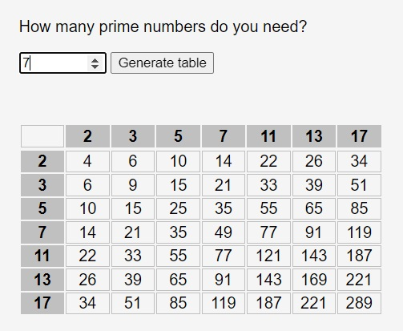
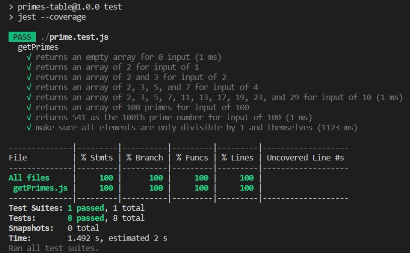

# primes-table
## An application that takes a numeric input (N) from a user and outputs a multiplication table of (N) prime numbers.

# live demo 
Please checkout the below link to test it online 

https://jamesbaylor.github.io/primes-table/

# testing
for running test cases run below commands in your terminal: 

1- `git clone https://github.com/jamesbaylor/primes-table.git`

2- `cd primes-table`

3- `npm install`

4- `npm run test`

